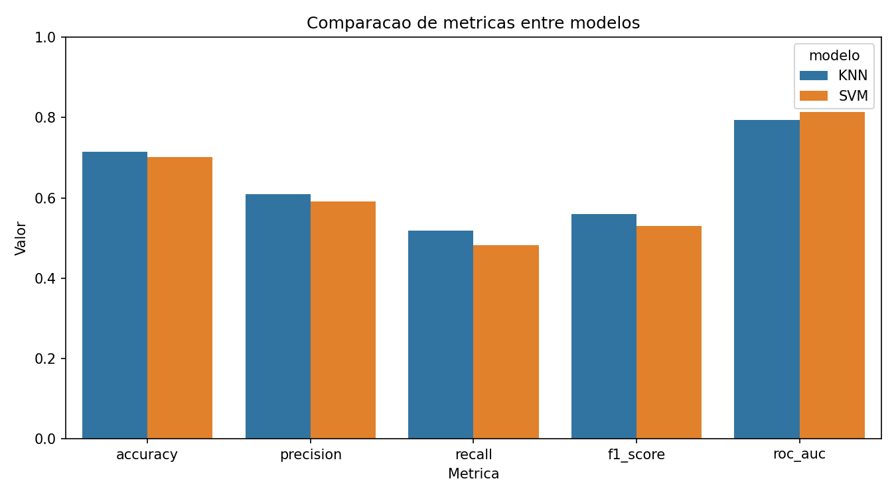
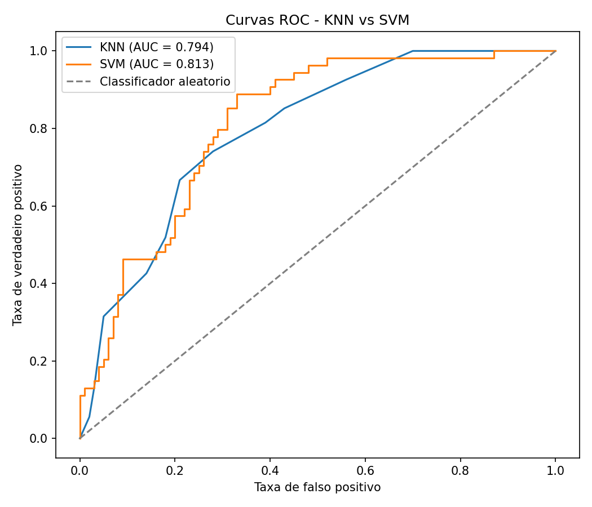
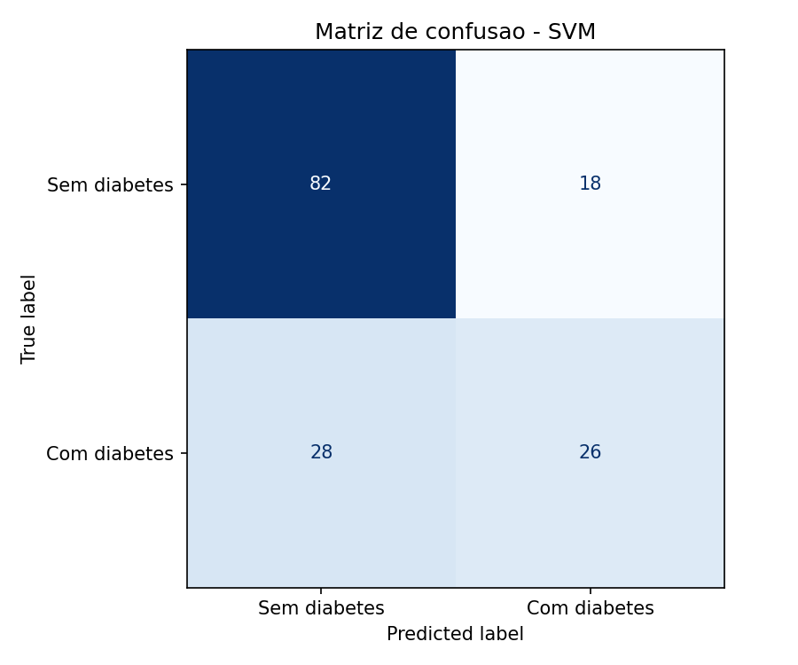

Disciplina de Inteligência Artificial , Professor Munif , Unicesumar 2026

# Trabalho Final - Predição de Diabetes (Pima Indians)

## Integrantes

- Pedro Henrique da Silva - RA: 23021607-2
- Victor Hugo Rodrigues de Oliveira - RA: 23418156-2
- Victor Hungo Silva Garcia - RA: 23030968-2

## Resumo do projeto

### Contextualização

O diabetes mellitus é uma doença crônica que afeta milhões de pessoas no mundo. A detecção precoce é fundamental para reduzir complicações e melhorar a qualidade de vida dos pacientes. Com o avanço da Inteligência Artificial, modelos de aprendizado de máquina podem apoiar a identificação de padrões em dados clínicos e auxiliar profissionais de saúde na triagem de risco.

### Problema investigado

Este trabalho investiga se é possível prever a presença de diabetes em pacientes da etnia Pima Indians com base em variáveis clínicas e demográficas, como glicose, pressão arterial, IMC e idade.

### Hipótese

Acreditamos que modelos de classificação supervisionada conseguem distinguir pacientes com e sem diabetes a partir dos atributos disponíveis. Em especial, esperamos que o **SVM** apresente desempenho competitivo após a padronização dos dados, enquanto o **KNN** pode ser sensível à escolha do número de vizinhos e à distribuição das classes.

### Dataset utilizado

| Item | Descrição |
|------|-----------|
| Nome | Pima Indians Diabetes Database |
| Origem | [Kaggle - UCI ML Repository](https://www.kaggle.com/datasets/uciml/pima-indians-diabetes-database) |
| Registros | 768 amostras |
| Atributos | 8 variáveis numéricas |
| Variável alvo | `Outcome` (0 = sem diabetes, 1 = com diabetes) |

**Atributos principais:**

- `Pregnancies`: número de gestações
- `Glucose`: concentração de glicose no plasma
- `BloodPressure`: pressão arterial diastólica (mm Hg)
- `SkinThickness`: espessura da dobra cutânea do tríceps (mm)
- `Insulin`: insulina sérica (mu U/ml)
- `BMI`: índice de massa corporal
- `DiabetesPedigreeFunction`: função de pedigree diabético
- `Age`: idade em anos

### Preparação dos dados

1. Download automático do dataset na primeira execução (`data/diabetes.csv`).
2. Substituição de zeros inválidos por valores ausentes nas variáveis clínicas.
3. Imputação de valores ausentes pela mediana.
4. Padronização com `StandardScaler`.
5. Divisão estratificada em treino (80%) e teste (20%).

### Métodos de IA utilizados

| Parte da disciplina | Algoritmo | Implementação |
|---------------------|-----------|---------------|
| Parte 1 | KNN (k-Nearest Neighbors) | `KNeighborsClassifier` com busca de `k` |
| Parte 2 | SVM (Support Vector Machine) | `SVC` com busca de hiperparâmetros |

Ambos os modelos foram treinados com validação cruzada estratificada (5 folds).

## Como executar

### 1. Criar ambiente virtual

```bash
python -m venv .venv
```

**Windows (PowerShell):**

```powershell
.\.venv\Scripts\Activate.ps1
```

**Linux/macOS:**

```bash
source .venv/bin/activate
```

### 2. Instalar dependências

```bash
pip install -r requirements.txt
```

### 3. Baixar o dataset (opcional)

O projeto já baixa automaticamente na primeira execução. Se preferir baixar manualmente do Kaggle:

1. Acesse o [dataset no Kaggle](https://www.kaggle.com/datasets/uciml/pima-indians-diabetes-database).
2. Faça o download do arquivo `diabetes.csv`.
3. Coloque o arquivo em `data/diabetes.csv`.

Alternativa automática:

```bash
python scripts/download_data.py
```

### 4. Treinar e avaliar os modelos

```bash
python main.py
```

Esse comando:

- treina KNN e SVM;
- salva os modelos em `models/`;
- gera métricas em `outputs/`;
- gera gráficos em `outputs/figures/`.

## Modelos treinados

Após executar `python main.py`, os modelos ficam disponíveis em:

- `models/knn_model.joblib`
- `models/svm_model.joblib`

Cada arquivo contém o classificador, o pipeline de pré-processamento e as métricas obtidas.

## Avaliação dos modelos

As métricas utilizadas foram:

- Acurácia
- Precisão
- Revocação (Recall)
- F1-score
- ROC-AUC

### Gráficos gerados

| Gráfico | Arquivo |
|---------|---------|
| Matriz de confusão - KNN | `outputs/figures/matriz_confusao_knn.png` |
| Matriz de confusão - SVM | `outputs/figures/matriz_confusao_svm.png` |
| Busca do melhor k no KNN | `outputs/figures/knn_busca_k.png` |
| Comparação de métricas | `outputs/figures/comparacao_metricas.png` |
| Curvas ROC | `outputs/figures/curvas_roc.png` |








> **Observação:** os gráficos acima aparecem corretamente após a primeira execução de `python main.py`.

## Comparação dos resultados

Os resultados completos são salvos em `outputs/metricas_comparacao.csv` e `outputs/conclusao.json`.

Critério de comparação adotado:

1. F1-score
2. ROC-AUC
3. Acurácia

## Conclusão

O projeto demonstra o fluxo completo de uma solução de IA: definição do problema, preparação dos dados, treinamento, avaliação e comparação entre modelos. Os resultados permitem discutir qual algoritmo se adapta melhor ao problema de classificação de diabetes e quais hiperparâmetros influenciaram o desempenho.

Após executar o projeto, utilize os valores gerados em `outputs/conclusao.json` para complementar a análise final da apresentação.

## Estrutura do repositório

```text
trabalho-final-ia-diabetes/
├── data/
│   └── diabetes.csv
├── docs/
│   └── relatorio.pdf
├── models/
│   ├── knn_model.joblib
│   └── svm_model.joblib
├── outputs/
│   ├── figures/
│   └── metricas_comparacao.csv
├── scripts/
│   └── download_data.py
├── src/
├── main.py
├── requirements.txt
└── README.md
```
